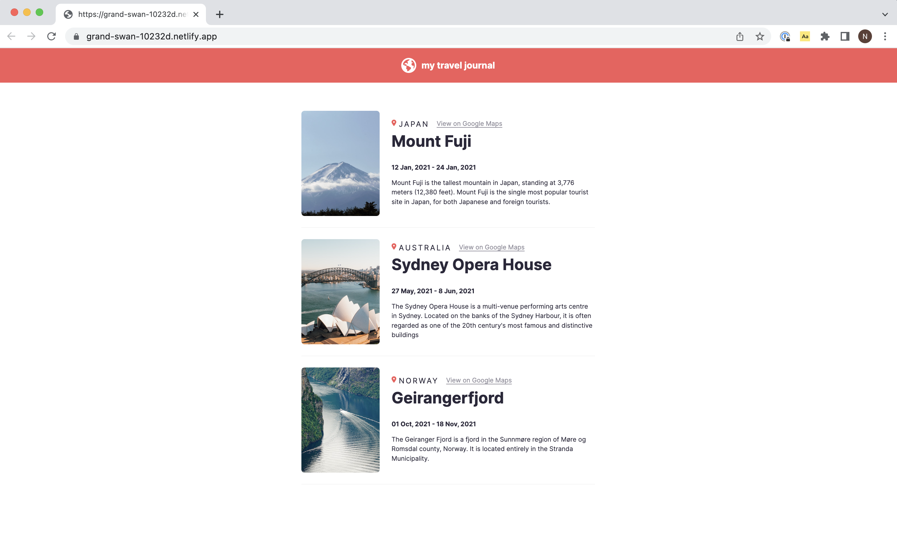

# Travel journal

Fictional travel journal with the info about the three latest trips

## Features
The journal includes the dates, location and description about the trips.

## Demo

Test it on Netlify: https://grand-swan-10232d.netlify.app

## Technologies
The project is built using:
* React
* JavaScript
* CSS
* HTML

## Technical details
* Used separate components for each section.
* Used .map() and props.
* Rendered by using React.
* Followed the design file on Figma.

## Project status
The project is complete.

## Acknowledgements
Travel journal is a solo project that was part of [the Frontend Developer Career Path at Scrimba](https://scrimba.com/learn/frontend).

## Contact
Created by [Natalia Davtyan](https://github.com/nataliadavtyan)
